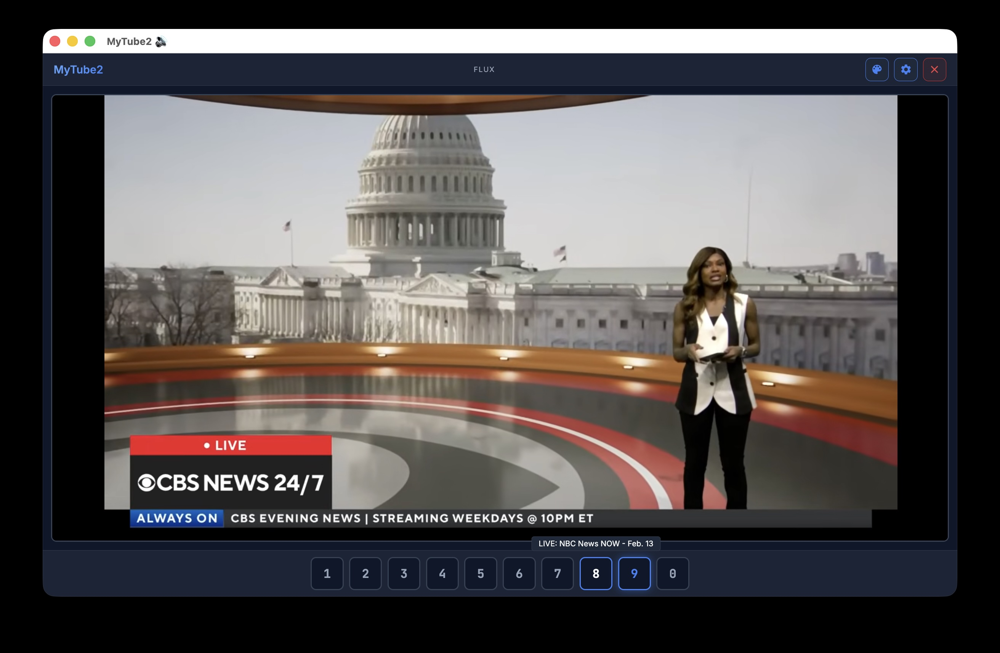

# MyTube2

A lightweight desktop YouTube viewer that feels like flipping TV channels. Assign YouTube videos or live streams to 10 channel buttons and switch between them instantly.



## Features

- **10 preset channels** — assign any YouTube video or live stream URL to buttons 1-0
- **App mode** — launches in a minimal Chrome/Chromium window (no tabs, no address bar)
- **4 switchable themes** — Flux, Wood, Plastic, Plasma
- **Video title tooltips** — hover a channel button to see the video title
- **Settings modal** — configure all channel URLs in one place
- **Quit button** — cleanly shuts down the server from the UI
- **Cross-platform** — works on macOS, Windows, and Linux

## Quick Start

```bash
npm install
npm run build
node server.js
```

The app will open automatically in Chrome app mode. If Chrome isn't found, it falls back to your default browser.

### macOS

Double-click `MyTube2.app` or `start_macos.command`.

### Windows

Double-click `start_windows.bat`.

## Development

```bash
npm run dev
```

Starts the Vite dev server with hot reload on `http://localhost:5173`.

## How It Works

MyTube2 is a Vite + vanilla JS frontend served by a small Express backend. The server stores channel URLs in `channels.json`, fetches video titles via YouTube's oEmbed API (no API key needed), and launches the browser in app mode on startup.

## Stack

- **Frontend:** Vanilla JS, CSS, Vite
- **Backend:** Express (Node.js)
- **Port:** 3998
